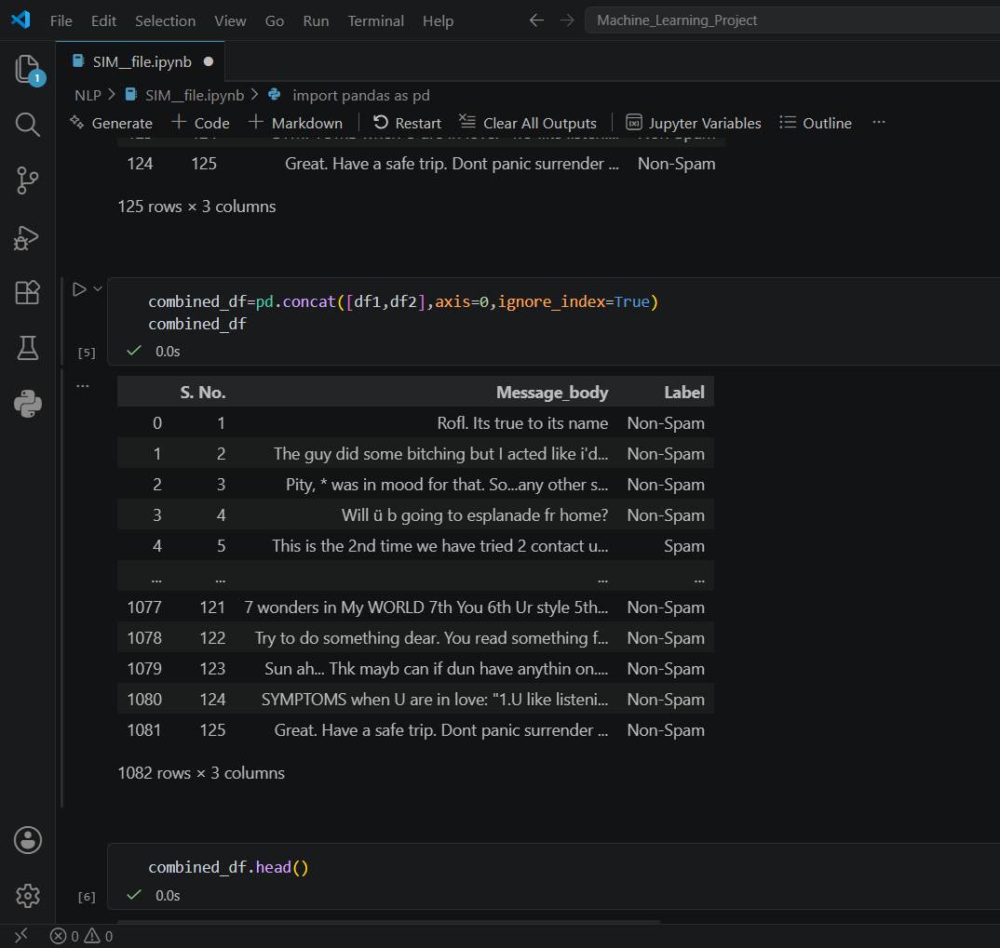

# 📩 SMS Spam Detection Using Machine Learning

An end-to-end Machine Learning project that classifies SMS messages as **Spam** or **Ham (Non-Spam)** using Natural Language Processing (NLP) techniques. Multiple machine learning algorithms were trained and evaluated to identify the best-performing model.

---

## 📌 Project Overview

The objective of this project is to build a text classification model capable of automatically detecting spam SMS messages. The project covers the complete machine learning workflow, including data preprocessing, text vectorization, model training, evaluation, and performance comparison.

---

## 🛠️ Technologies Used

* **Python**
* **Pandas** & **NumPy** (Data cleaning & manipulation)
* **NLTK** (Natural Language Toolkit for text processing)
* **Scikit-learn** (Machine learning algorithms & evaluation)
* **Jupyter Notebook**

---

## 🧠 Skills Demonstrated

* Machine Learning (Classification)
* Natural Language Processing (NLP)
* Data Cleaning & Preprocessing
* Text Feature Extraction
* Model Training & Evaluation
* Data Visualization
* Python Programming

---

## ⚙️ NLP Pipeline

The SMS messages were processed using the following steps:

1. Text cleaning
2. Lowercase conversion
3. Tokenization
4. Stopword removal
5. Stemming
6. Text vectorization
7. Model training and prediction

---

## 🤖 Models Evaluated

| Model | Accuracy |
| :--- | :---: |
| KNeighborsClassifier | 81% |
| SVC (Support Vector Classifier) | 88% |
| MultinomialNB (Naive Bayes) | 90% |
| **DecisionTreeClassifier** | **91%** |

### 🏆 Best Performing Model
The **DecisionTreeClassifier** achieved the highest accuracy of **91%** on the test dataset.

---

## 📂 Project Structure

```
SMS-Spam-Detection/
│
├── SIM_file.ipynb
├── SMS_train.csv
├── SMS_test.csv
├── screenshots/
│   └── dataset_preview.png
└── README.md
```

### Dataset Preview
Below is a preview of the dataset being combined and preprocessed inside the notebook:



---

## 📊 Dataset

The project uses separate training and testing datasets containing SMS messages labeled as either **Spam** or **Ham (Non-Spam)**. The datasets are merged and preprocessed before training the machine learning models.

---

## 🚀 How to Run

1. Clone this repository.
   ```bash
   git clone <repository-link>
   ```
2. Navigate to the project folder.
   ```bash
   cd SMS-Spam-Detection
   ```
3. Install the required libraries.
   ```bash
   pip install pandas numpy nltk scikit-learn jupyter
   ```
4. Launch Jupyter Notebook.
   ```bash
   jupyter notebook
   ```
5. Open `SIM_file.ipynb` and run all cells.

---

## 📈 Future Improvements

* Apply TF-IDF Vectorization
* Perform Hyperparameter Tuning
* Experiment with ensemble models such as Random Forest and XGBoost
* Deploy the model using Streamlit or Flask
* Build a real-time SMS spam prediction web application

---

## 👨‍💻 Author

**M R Arjun**
Aspiring Data Scientist | Machine Learning & Data Analytics Enthusiast

If you found this project useful, feel free to ⭐ the repository.
